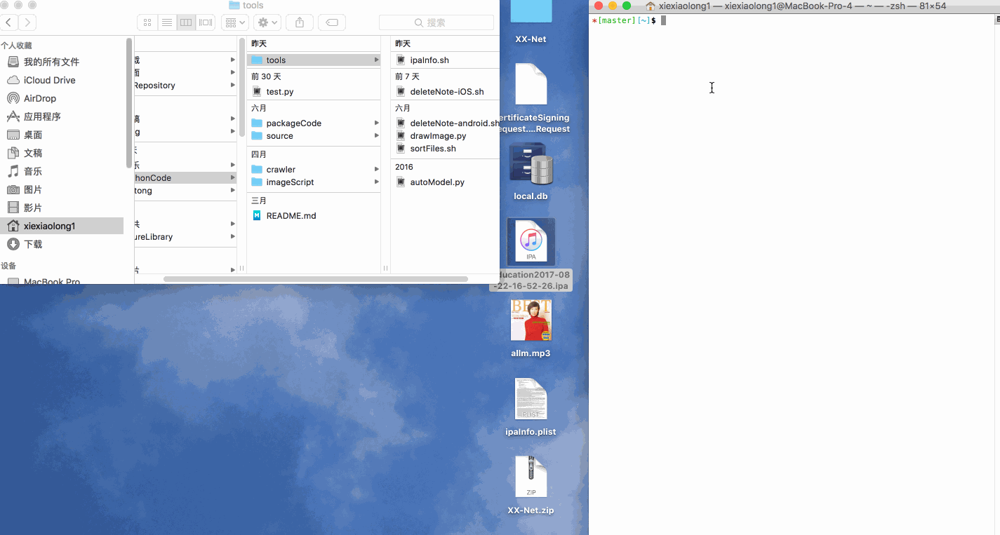

# iOS包ipa文件相关签名信息获取脚本

> 在iOS开发过程中经常遇到要签名打包测试，有时候甲方测试人员会出现安装不上的情况，原因很多：安装工具问题、udid没添加、证书没更新、证书过期等情况。要排除这些情况就变得很有必要。在这里分享一个获取ipa包文件信息的[脚本](https://github.com/ScriptStorage/ipaInfo).

> 使用方法，终端执行: `bash /path/script.sh /paht/xxx.ipa`
会在桌面生成并打开一个`ipaInfo.plist`文件，里面包含`ipa`的签名信息.

